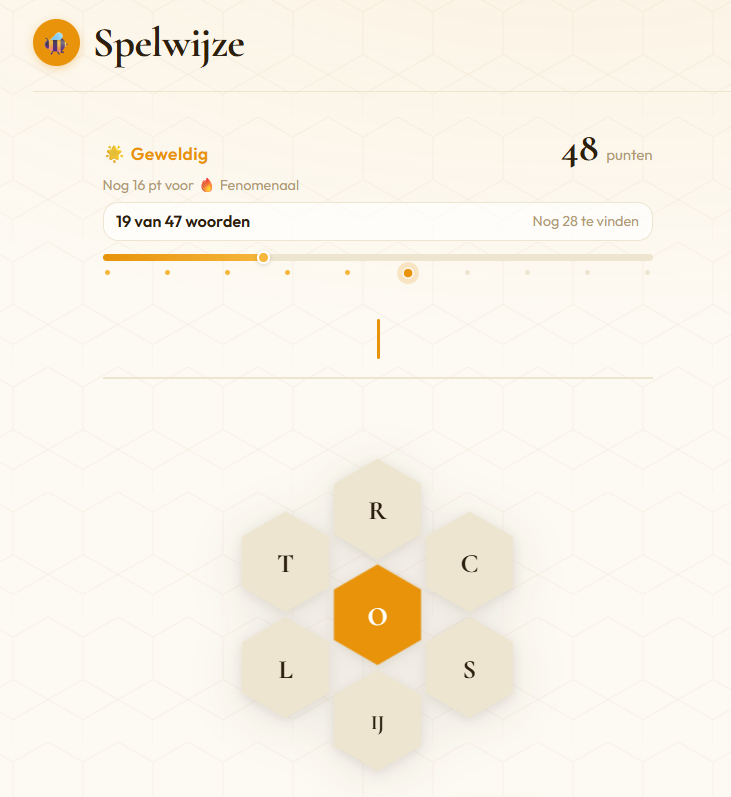

# Spelwijze

Een kleine webimplementatie van het Nederlandse woordspel **Spelwijze**, geïnspireerd door de puzzel uit de Volkskrant.

Speel hier:  
https://casperatuu.github.io/spelwijze

## Het spel

Je krijgt zeven letters in een honingraat.  
De middelste letter is verplicht.

Vorm zoveel mogelijk woorden:

- elk woord bevat de **middelste letter**
- alleen de **zeven gegeven letters** mogen gebruikt worden
- letters mogen **meerdere keren** gebruikt worden
- minimumlengte: **4 letters**
- het woord moet in de **woordenlijst** voorkomen

Een **pangram** gebruikt alle zeven letters en levert bonuspunten op.

Het doel is om alle mogelijke woorden te vinden.

## Kenmerken van deze versie

- volledig **client-side spel** (één HTML-bestand)
- werkt **offline**
- gebaseerd op een **Nederlandse lemmawoordenlijst**
- puzzels zijn geselecteerd zodat ze ongeveer **35–60 oplossingen** hebben
- voortgang wordt **lokaal opgeslagen**

## Bediening

- typ letters op het toetsenbord  
- **Enter** — woord indienen  
- **Backspace** — letter verwijderen  
- **Spatie** — letters schudden  

## Techniek

Het spel is een **statische webapp** zonder externe afhankelijkheden.

- JavaScript voor spelregels en woordvalidatie  
- SVG/CSS voor de honingraatinterface  
- `localStorage` voor voortgang  

Omdat alles in één bestand zit kan het eenvoudig worden gehost via **GitHub Pages**.

## Woordenlijst

De puzzels gebruiken een **Nederlandse lemmawoordenlijst**, waardoor vormen zoals:

- werkwoordsvervoegingen  
- meervouden  
- verkleinwoorden  
- vergrotende trap  

meestal niet als aparte oplossingen voorkomen.

## Licentie

Vrij te gebruiken en aan te passen.
